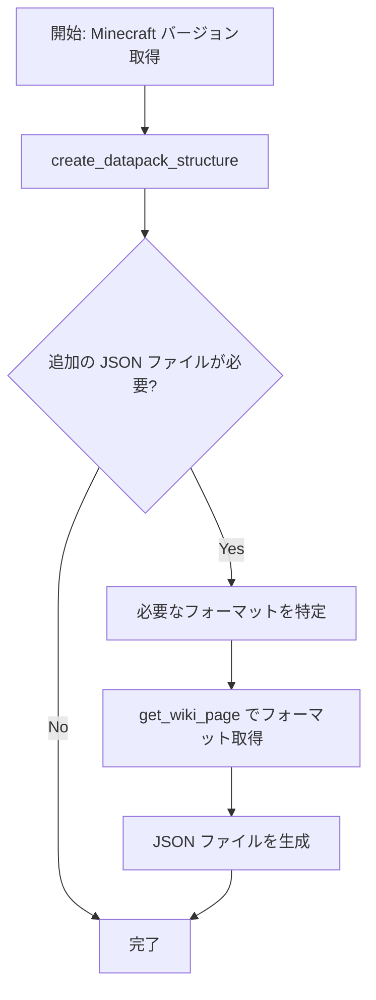
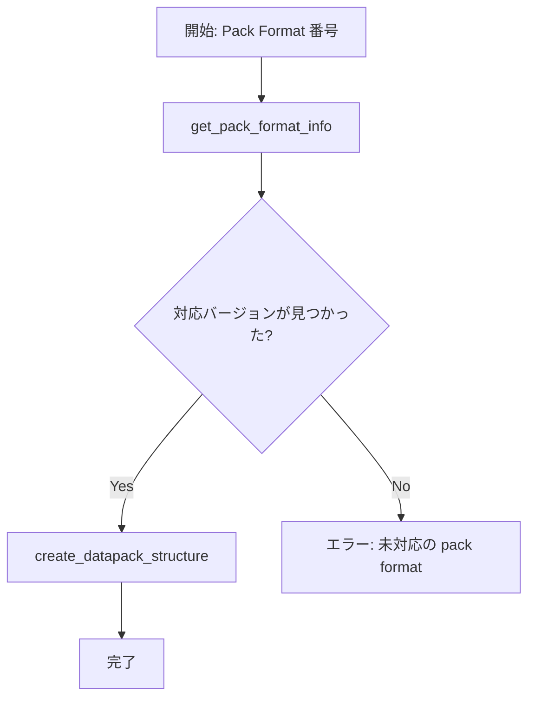
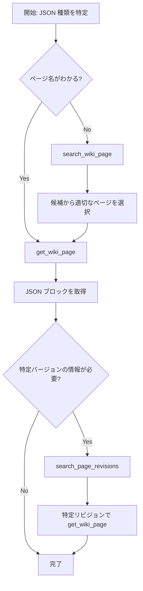
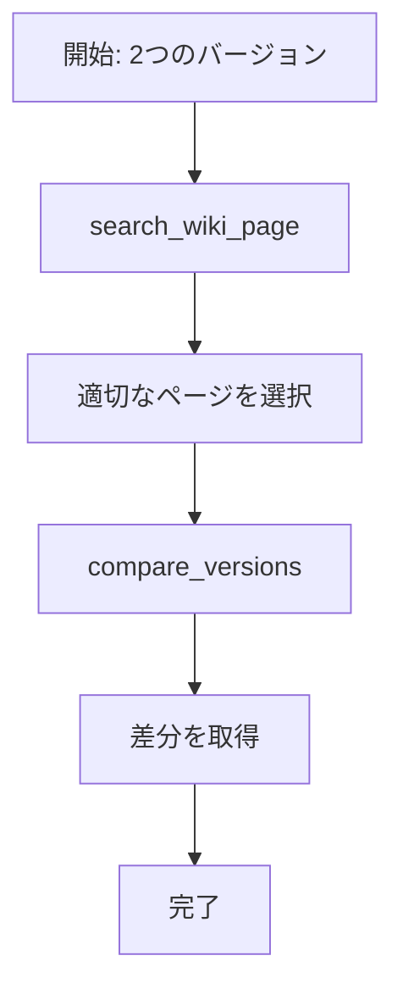
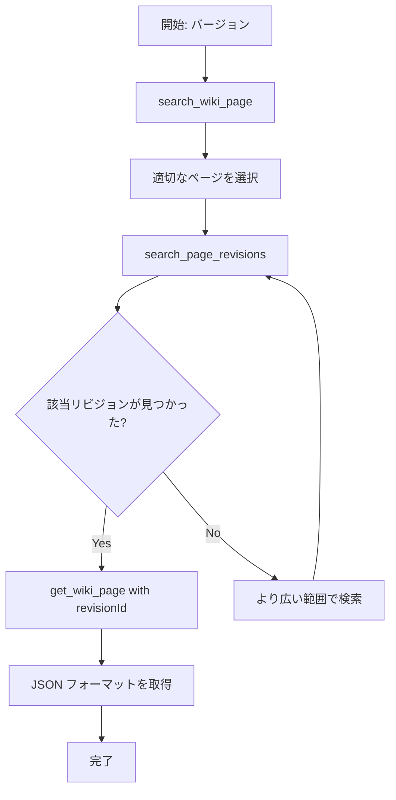

# Usage Guide for AI Agents

このドキュメントは、AI エージェントが Minecraft Wiki MCP Server を効果的に使用するためのガイドです。

## 目次

- [基本概念](#基本概念)
- [シナリオ別フロー](#シナリオ別フロー)
  - [シナリオ 1: Minecraft バージョンから Datapack を作成](#シナリオ-1-minecraft-バージョンから-datapack-を作成)
  - [シナリオ 2: Pack Format から Datapack を作成](#シナリオ-2-pack-format-から-datapack-を作成)
  - [シナリオ 3: 特定の JSON フォーマット仕様を取得](#シナリオ-3-特定の-json-フォーマット仕様を取得)
  - [シナリオ 4: バージョン間の JSON フォーマット変更を確認](#シナリオ-4-バージョン間の-json-フォーマット変更を確認)
  - [シナリオ 5: 古いバージョンの仕様を調査](#シナリオ-5-古いバージョンの仕様を調査)
- [ツール一覧と使用タイミング](#ツール一覧と使用タイミング)
- [エラーハンドリング](#エラーハンドリング)

---

## 基本概念

### ツールの分類

#### 即座に実行可能なツール（前提条件なし）

- `create_datapack_structure` - Minecraft バージョンさえわかれば即実行可能
- `get_pack_format_info` - バージョンまたは pack format 番号があれば即実行可能
- `search_wiki_page` - 検索クエリがあれば即実行可能

#### ページタイトルが必要なツール（前提: ページタイトルの把握）

- `get_wiki_page` - 正確なページタイトルが必要
- `search_page_revisions` - 正確なページタイトルが必要
- `compare_versions` - 正確なページタイトルが必要

### ページタイトルの取得方法

1. **`search_wiki_page` で検索**: ページ名が不明な場合に検索

---

## シナリオ別フロー

### シナリオ 1: Minecraft バージョンから Datapack を作成

**ユーザーの要求例**: "Minecraft 1.21.2 用の datapack を作りたい"

#### フロー



#### ステップ詳細

1. **`create_datapack_structure` を呼び出し**

   ```json
   {
     "minecraftVersion": "1.21.2",
     "namespace": "my_datapack",
     "description": "My custom datapack",
     "features": ["functions", "recipes", "loot_tables"]
   }
   ```

   - **結果**: pack.mcmeta、ディレクトリ構造、命名規則、警告を取得

2. **（オプション）特定の JSON フォーマットが必要な場合**
   - 例: レシピファイルを作成したい → シナリオ 3 へ

---

### シナリオ 2: Pack Format から Datapack を作成

**ユーザーの要求例**: "pack_format 48 の datapack を作りたい"

#### フロー



#### ステップ詳細

1. **`get_pack_format_info` で対応バージョンを確認**

   ```json
   {
     "packFormat": 48
   }
   ```

   - **結果**: 対応する Minecraft バージョンのリスト（例: "1.20.5-1.20.6"）

2. **バージョンを選択して `create_datapack_structure` を呼び出し**
   ```json
   {
     "minecraftVersion": "1.20.5",
     "namespace": "my_datapack"
   }
   ```

---

### シナリオ 3: 特定の JSON フォーマット仕様を取得

**ユーザーの要求例**: "Minecraft 1.21 のレシピ JSON フォーマットを教えて"

#### フロー



#### ステップ詳細

##### パターン A: ページ名が既知の場合

1. **`get_wiki_page` を直接呼び出し**
   ```json
   {
     "title": "Recipe",
     "extractJson": true
   }
   ```
   - **結果**: ページ内容と JSON コードブロックの配列

##### パターン B: ページ名が不明な場合

1. **`search_wiki_page` でページを検索**

   ```json
   {
     "query": "recipe format",
     "limit": 10
   }
   ```

   - **結果**: 候補ページのリスト（例: ["Recipe", "Recipe book", "Recipes"]）

2. **適切なページを選択して `get_wiki_page` を呼び出し**
   ```json
   {
     "title": "Recipe",
     "extractJson": true
   }
   ```

##### パターン C: 特定バージョンの情報が必要な場合

3. **`search_page_revisions` でバージョン関連のリビジョンを検索**

   ```json
   {
     "title": "Recipe",
     "versionPattern": "1.21",
     "limit": 10
   }
   ```

   - **結果**: "1.21" に関連する編集履歴

4. **特定のリビジョンで `get_wiki_page` を呼び出し**
   ```json
   {
     "title": "Recipe",
     "revisionId": 3269126,
     "extractJson": true
   }
   ```

---

### シナリオ 4: バージョン間の JSON フォーマット変更を確認

**ユーザーの要求例**: "レシピフォーマットは 1.20 から 1.21 で何が変わった？"

#### フロー



#### ステップ詳細

1. **`search_wiki_page` でページを特定**

   ```json
   {
     "query": "recipe",
     "limit": 5
   }
   ```

2. **`compare_versions` を呼び出し**
   ```json
   {
     "title": "Recipe",
     "version1": "1.20",
     "version2": "1.21"
   }
   ```
   - **結果**: 両バージョンの JSON ブロックと差分

---

### シナリオ 5: 古いバージョンの仕様を調査

**ユーザーの要求例**: "Minecraft 1.16 のルートテーブルフォーマットを確認したい"

#### フロー



#### ステップ詳細

1. **`search_wiki_page` でページを特定**

   ```json
   {
     "query": "loot table",
     "limit": 5
   }
   ```

2. **`search_page_revisions` でバージョン関連の編集を検索**

   ```json
   {
     "title": "Loot table",
     "versionPattern": "1.16",
     "limit": 20
   }
   ```

   - **結果**: "1.16" に関連する編集履歴とリビジョン ID

3. **適切なリビジョンで `get_wiki_page` を呼び出し**
   ```json
   {
     "title": "Loot table",
     "revisionId": 1234567,
     "extractJson": true
   }
   ```

---

## ツール一覧と使用タイミング

| ツール                      | いつ使う？                                       | 前提条件                                   | 出力                                  |
| --------------------------- | ------------------------------------------------ | ------------------------------------------ | ------------------------------------- |
| `create_datapack_structure` | Datapack の基本構造を生成したい                  | Minecraft バージョン                       | pack.mcmeta、ディレクトリ構造、警告   |
| `get_pack_format_info`      | Pack format とバージョンの対応を知りたい         | バージョンまたは pack format 番号          | pack_format、対応バージョン、命名規則 |
| `search_wiki_page`          | ページ名が不明で検索したい                       | 検索クエリ                                 | ページタイトルのリスト                |
| `get_wiki_page`             | 特定ページの最新または特定バージョンの内容を取得 | **正確なページタイトル**                   | ページ内容、JSON ブロック             |
| `search_page_revisions`     | 特定バージョンに関連する編集履歴を探す           | **正確なページタイトル**                   | リビジョンのリスト                    |
| `compare_versions`          | 2 つのバージョン間の差分を確認                   | **正確なページタイトル**、2 つのバージョン | 差分と両方の JSON ブロック            |

### 依存関係グラフ

```
search_wiki_page (ページ検索)
    ↓
    ├→ get_wiki_page (内容取得)
    ├→ search_page_revisions (履歴検索)
    │       ↓
    │       └→ get_wiki_page with revisionId
    └→ compare_versions (バージョン比較)

create_datapack_structure (独立)
get_pack_format_info (独立)
```

---

## エラーハンドリング

### ページが見つからない場合

**エラー**: `get_wiki_page`、`search_page_revisions`、`compare_versions` で不正なページタイトル

**対処法**:

1. エラーレスポンスに含まれる `suggestions` を確認
2. 提案されたページタイトルで再試行
3. または `search_wiki_page` で検索し直す

**例**:

```json
// エラーレスポンス
{
  "error": "Page \"Recipee\" not found",
  "suggestions": ["Recipe", "Recipe book", "Recipes"],
  "message": "Did you mean one of these pages?"
}

// 修正して再試行
{
  "title": "Recipe"
}
```

### リビジョンが見つからない場合

**エラー**: `get_wiki_page` で不正な revisionId

**対処法**:

1. エラーレスポンスの `suggestion.nearestRevision` を使用
2. 提案されたリビジョン ID で再試行

**例**:

```json
// エラーレスポンス
{
  "error": "Revision 9999999 not found",
  "suggestion": {
    "nearestRevision": 3269126,
    "timestamp": "2024-11-15T12:34:56Z",
    "message": "Try using revision 3269126 instead"
  }
}

// 修正して再試行
{
  "title": "Recipe",
  "revisionId": 3269126
}
```

### バージョンパターンで結果が見つからない場合

**エラー**: `search_page_revisions` または `compare_versions` で該当なし

**対処法**:

1. バージョンパターンを緩和（例: "1.21.2" → "1.21"）
2. 日付範囲を広げる
3. `limit` を増やす

---

## ベストプラクティス

### 1. ページタイトルの確認

**重要**: ページタイトルを使用する前に**必ず** `search_wiki_page` で検索してから他のツールを使う。
想定したページが存在しない、または名前が異なる可能性があるため、いきなりページ名を指定してはいけません。

**❌ 悪い例**:

```json
// いきなりページ名を指定（タイトルが間違っている可能性がある）
{ "title": "Recipe" }
```

**✅ 良い例**:

```json
// 1. まず検索でページを確認
{"query": "recipe", "limit": 5}
// 2. 検索結果から正確なタイトルを確認してから呼び出し
{"title": "Recipe"}
```

### 2. JSON 抽出の活用

フォーマット情報が必要な場合は必ず `extractJson: true` を指定。

**✅ 良い例**:

```json
{
  "title": "Recipe",
  "extractJson": true
}
```

### 3. キャッシュの活用

同じパラメータでの呼び出しはキャッシュから返されるため、重複呼び出しを恐れない。

### 4. エラーメッセージの活用

エラーレスポンスには有用な提案が含まれているため、必ず確認して再試行する。

---

## FAQ

### Q1: ページタイトルの大文字小文字は区別される？

A: はい、区別されます。必ず正確なタイトルを使用してください。不明な場合は `search_wiki_page` で確認してください。

### Q2: 最新の情報を取得するには？

A: `get_wiki_page` を `revisionId` なしで呼び出せば、常に最新版が取得されます。

### Q3: 複数バージョンの変更履歴を一度に確認できる？

A: `compare_versions` は 2 つのバージョン間の比較のみです。複数バージョンの場合は複数回呼び出してください。

### Q4: Pre-release や Snapshot に対応している？

A: はい、`create_datapack_structure` は "1.21.2-pre1" や "24w44a" などの形式に対応しています。

### Q5: どのツールが一番重要？

A: ユースケース次第ですが、`create_datapack_structure` は Datapack 作成の基礎として最も重要です。JSON フォーマット調査には `get_wiki_page` が中心になります。
